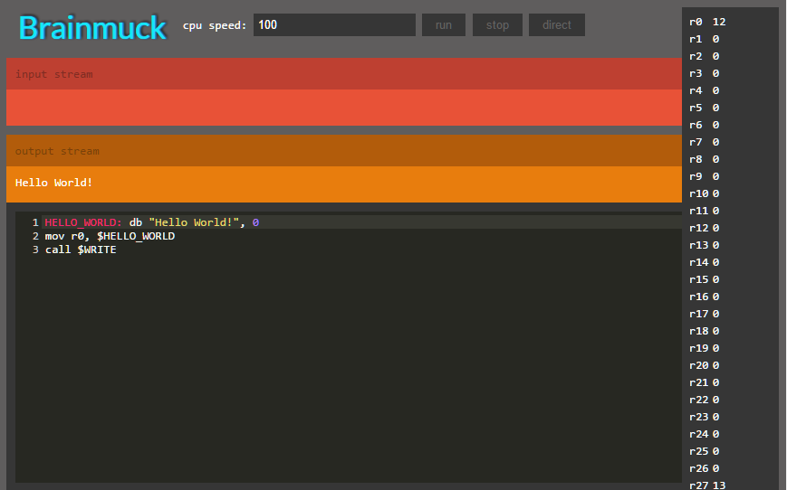

The simple assembly language script. Our goal is reach to 8051..

Keep it alive
--------------

Just needs a lovely browser. Nothing more.. If you just want to see this shit 

## **[click me](https://cdn.rawgit.com/co3moz/brainmuck/master/src/public/index.html)**

Registers
------------------

Registers that can be used; `r0` -> `r31`

> **Note:** some registers are used by cpu itself, you can change them but this could affect bad scenerios. Please use them wisely..

| register 	| alias 	| name            	|
|:----------:|:-------:|:-----------------:|
| r31      	| $PC   	| Program Counter 	|
| r30      	| $BR   	| Branch Register 	|
| r29      	| $SP   	| Stack Pointer   	|
| r28      	| $RP   	| Return Pointer  	|
| r27      	| $DP   	| Data Pointer    	|

Register and Data Accessor
----------------------------

Those things called `RDA`. If Immediately Data can be used than we call them `RDAI`

| Type                	| Format      	| Example          	| Code example                                	|
|---------------------	|-------------	|------------------	|---------------------------------------------	|
| Immediately Data    	| `#number`     	| `#3` <br>`#-3` <br>`#16h` (22) 	| `mov r0, #3`  <br>r0 = 3                        	|
| Immediately Address 	|` number`      	| `3` <br>`5` <br>`16h` (22)     	| `mov 3, #10` <br>`mov r0, 3` <br>r0 = 10              	|
| Register            	| `r + number`  	| `r0` <br>`r5` <br>`r10`        	| `mov r5, #6` <br>`mov r0, r5` <br>r0 = 6              	|
| Register Point      	| `@r + number` 	| `@r0` <br>`@r5`          	| `mov 5, #10` <br>`mov r0, #5` <br>`mov r0, @r0` <br>r0 = 10 	|

Instruction table
--------------------

> **Note:** this version of brainmuck doesn't have 3 argument instructions..

| Instruction             	| Example                                                      | Purpose                                                                |
|-------------------------	|--------------------------------------------------------------|------------------------------------------------------------------------|
| `simulation memory RDA` 	| `simulation memory #16000`                                   | Overrides simulation memory (default is 64kb)                          |
| `mov RDA, RDAI`         	| `mov r0, #5`                                                 | Sets right rdai to left rda,                                           |
| `out RDAI`              	| `out #48`                                                    | Sends rdai information to output                                       |
| `in RDA`                	| `in r0`                                                      | Reads rda information from input                                       |
| `add RDA, RDAI`         	| `add r0, #5`                                                 | Adds right rdai to left rda                                            |
| `inc RDA`               	| `inc r0`                                                     | Increments value by 1                                                  |
| `dec RDA`               	| `dec r0`                                                     | Decrements value by 1                                                  |
| `sub RDA, RDAI`         	| `sub r0, #5`                                                 | Subtracts right rdai to left rda                                       |
| `mul RDA, RDAI`         	| `mul r0, #5`                                                 | Multiplies right rdai to left rda                                      |
| `div RDA, RDAI`         	| `div r0, #5`                                                 | Divides right rdai to left rda                                         |
| `mod RDA, RDAI`         	| `mod r0, #5`                                                 | Modules right rdai to left rda                                         |
| `left shift RDA, RDAI`    | `left shift r0, #5`                                          | Left Shifts right rdai to left rda                                     |
| `right shift RDA, RDAI`   | `right shift r0, #5`                                         | Right  Shifts right rdai to left rda                                   |
| `push RDAI`               | `push r0`                                                    | Pushes the value to stack in memory                                    |
| `pop RDA`                 | `pop r0`                                                     | Pops the value from stack in memory to rda                             |
| `NAME: db DATA`           | `HELLO_WORLD: db "Hello World!", 0`                          | Stores information to memory by $DP                                    |
| `branch exit`             | `branch exit`                                                | If $BR is not 0 then exists from program                  	            |
| `jump exit`               | `jump exit`                                                  | Exists from program                                      	            |
| `branch back`             | `branch back`                                                | If $BR is not 0 then branches back to $RP              	            |
| `jump back`               | `jump back`                                                  | Branches back to $RP              	                                    |
| `branch LOCATION`         | `HERE: mov r0, #5`<br> some codes .. <br>`branch $HERE`      | If $BR is not 0 then branches LOCATION                  	            |
| `branch not LOCATION`     | `HERE: mov r0, #5`<br> some codes .. <br>`branch not $HERE`  | If $BR is 0 then branches LOCATION           	                        |
| `jump LOCATION`           | `HERE: mov r0, #5`<br> some codes .. <br>`jump $HERE`        | Branches LOCATION           	                                        |
| `call LOCATION`           | `HERE: mov r0, #5`<br> some codes .. <br>`call $HERE`        | Branches LOCATION and stores $PC to $RP                 	            |
| `equal RDAI, RDAI`        | `equal r0, #5`<br>`branch exit`                              | Sets $BR one if left rdai is equals right rdai          	            |
| `not equal RDAI, RDAI`    | `not equal r0, #5`<br>`branch exit`                          | Sets $BR one if left rdai is not equals right rdai      	            |
| `big RDAI, RDAI`          | `big r0, #5`<br>`branch exit`                                | Sets $BR one if left rdai is bigger than right rdai      	            |
| `big equal RDAI, RDAI`    | `big equal r0, #5`<br>`branch exit`                          | Sets $BR one if left rdai is bigger than or equal to right rdai      	|
| `small RDAI, RDAI`        | `small r0, #5`<br>`branch exit`                              | Sets $BR one if left rdai is smaller than right rdai                	|
| `small equal RDAI, RDAI`  | `small equal r0, #5`<br>`branch exit`                        | Sets $BR one if left rdai is smaller than or equal to right rdai      	|
| `nop`                     | `nop`                                                        | Just nothing.. (Eats some time)                                        |

Libraries
----------------
Libraries are defined in `src/public/bin` directory. We can easily add new asm files to use in our programs.

#### stream_write.asm

example usage for this library
##### WRITE
```asm
HELLO_WORLD: db "Hi! I'm brainmuck.. :)", 0
mov r0, $HELLO_WORLD
call $WRITE
```

| Parameter 	| Info 	| Will change? 	|
|-----------	|---------	|--------------	|
| r0 	| Address of text 	| Yes, it will became EOF(0) location 	|

##### WRITE_NUMBER
```asm
mov r0, #25
call $WRITE_NUMBER
```

| Parameter 	| Info 	| Will change? 	|
|-----------	|---------	|--------------	|
| r0 	| Value 	| No 	|

#### stream_read.asm

example usage for this library
##### READ_LINE
```asm
mov r0, #100
push r0
call $READ_LINE
pop r0
call $WRITE
```

| Parameter 	| Info 	| Will change? 	|
|-----------	|---------	|--------------	|
| r0 	| Address of text 	| Yes, it will became EOF(0) location 	|

> **Note:** r0 will became eof so you can easily find the length of text

Install
--------------

There is no need for node, there is no back side of this project, all frontend. But if we could need public serve application so that reason i used node here. 
For node you can use `npm i` yep thats it..

